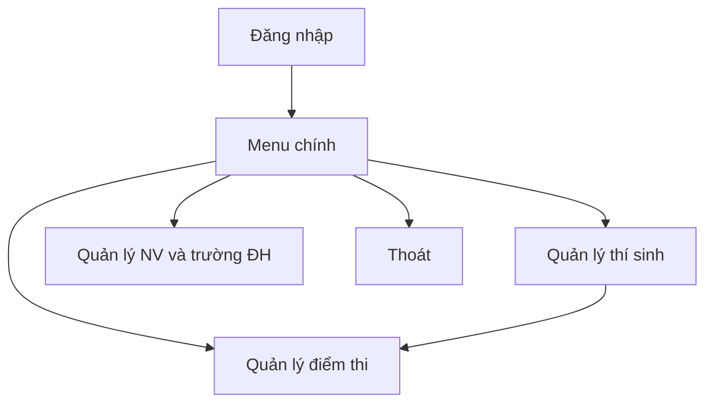
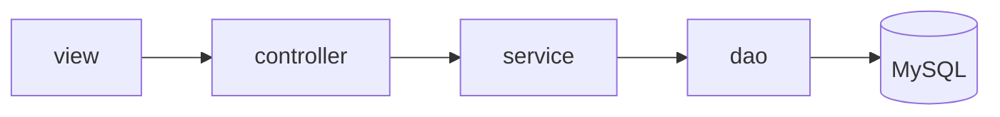

# Hệ thống quản lý thí sinh dự thi đại học

Ứng dụng **desktop Java** (Swing), giao diện **FlatLaf**, kết nối **MySQL** qua **Hibernate ORM 6 / JPA**. Kiến trúc tách lớp: **view → controller → service → DAO → cơ sở dữ liệu**.

| Thành phần | Công nghệ / phiên bản tiêu biểu |
|------------|----------------------------------|
| Ngôn ngữ & runtime | Java **21** |
| Giao diện | Swing + **FlatLaf 3.5** |
| ORM | Hibernate **6.5**, Jakarta Persistence **3.1** |
| CSDL | **MySQL** (Connector/J 9) |

---

## Chức năng chính

- **Đăng nhập** — xác thực tài khoản (demo), sau đó vào menu chính.
- **Quản lý thí sinh** — chỉnh sửa thông tin trên **bảng**; có thể mở **quản lý điểm** theo thí sinh đang chọn.
- **Quản lý điểm thi** — bảng điểm theo khối; lọc theo **số báo danh**; cập nhật / **xóa điểm** (ghi `NULL`, giữ bản ghi); **sắp xếp theo tổng điểm** và **thủ khoa từng khối** áp dụng trực tiếp **lên bảng chính**; **số lượng thí sinh theo khối** hiển thị trong **hộp thoại**; báo cáo dùng `BaoCaoService` qua `TimKiemThongKeController`.
- **Quản lý trường đại học & nguyện vọng** — hai tab: CRUD **trường**; **nguyện vọng** theo thí sinh (lọc combo bằng ô **Số BD**), thêm / sửa / xóa NV, sắp thứ tự NV; **tổng số nguyện vọng** toàn hệ thống; **chi tiết ngành theo trường** (dialog).

**Lưu ý:** Không còn màn hình “Thống kê” độc lập; các báo cáo được gắn vào **Quản lý điểm** và **Quản lý nguyện vọng / trường** như trên.

---

## Luồng giao diện



---

## Kiến trúc mã nguồn



### Cấu trúc thư mục (`src/main/java/com/example/quanlythisinh/`)

| Gói / vị trí | Nội dung |
|--------------|----------|
| `MainApp.java` | Khởi động EDT, FlatLaf, `UiStyles`, wiring service/controller, `LoginFrame` → `MainMenuFrame`, giải phóng JPA khi đóng menu. |
| `controller/` | `LoginController`, `ThiSinhController`, `DiemThiController`, `NguyenVongController`, `TimKiemThongKeController` (báo cáo; dùng chung với màn điểm & NV). |
| `service/` | `AuthService`, `ThiSinhService`, `DiemThiService`, `TruongDaiHocService`, `DangKyNguyenVongService`, `LookupService`, `BaoCaoService`. |
| `dao/` | Truy vấn JPA/JPQL: thí sinh, điểm, khối, trường, nguyện vọng. |
| `entity/` | Ánh xạ bảng: `ThiSinh`, `DiemThi`, `KhoiThi`, `TruongDaiHoc`, `DangKyNguyenVong`, … |
| `dto/` | Bản ghi “phẳng” cho `JTable` và báo cáo (ví dụ `ThiSinhTableRow`, `DiemThiTableRow`, `DangKyNguyenVongTableRow`, `ThongKeKhoiRow`, `ThuKhoaRow`, `NganhTheoTruongRow`, …). |
| `util/` | `JpaUtil` (factory, đọc `application.properties`), `ScoreUtil`, `TextUtil`. |
| `view/` | Các `JFrame` màn hình, `UiStyles`, `EditableGridSupport`, `ViewMessages`, hỗ trợ bảng / kéo thứ tự nếu có. |

### Tài nguyên (`src/main/resources/`)

| File | Mô tả |
|------|--------|
| `application.properties` | JDBC URL, user/password, dialect Hibernate, tùy chọn hiển thị SQL. |
| `META-INF/persistence.xml` | Persistence unit `qlts-pu`, danh sách entity. |
| `mysql_university_entrance_exam.sql.txt` | Script SQL mẫu (schema / dữ liệu thử). |

Thư mục `docs/` dùng cho tài liệu thiết kế CSDL và script migration bổ sung (ví dụ cột nullable); **`JpaUtil`** có thể tự **`ALTER`** cột điểm / ngành NV sang **NULL** khi kết nối MySQL và phát hiện schema cũ (tương đương ý `docs/migrate_optional_nulls.sql`).

---

## Giao diện & chủ đề

- Font ưu tiên **Segoe UI** (fallback hệ thống).
- Menu chính: nền **#ECF0F1**, header **#2C3E50**, thẻ trắng bo góc; nút primary **#4A90E2**.
- Các màn hình khác dùng bảng màu thống nhất qua `UiStyles` (nền trang, header bảng, v.v.).

---

## Yêu cầu & cấu hình

1. **MySQL** — tạo database (ví dụ `quan_ly_thi_sinh` khớp URL trong `application.properties`).
2. **Schema & dữ liệu** — một trong các cách:
   - Chạy script trong `mysql_university_entrance_exam.sql.txt`, **hoặc**
   - Dùng bộ sinh dữ liệu ngoài project (ví dụ thư mục **`ThiSinhToolkit`** cùng workspace: Python + `generated_exam_data.sql`) nếu bạn có sẵn.
3. Sửa **`src/main/resources/application.properties`**: `db.url`, `db.username`, `db.password` đúng với máy bạn.
4. `hibernate.hbm2ddl.auto=none` — không tự tạo bảng từ entity; schema do script SQL.

---

## Build và chạy

```bash
mvn clean package
```

JAR đầy đủ dependency (tên mặc định Maven Assembly):

```bash
java -jar target/quan-ly-thi-sinh-du-thi-dai-hoc-1.0.0-jar-with-dependencies.jar
```

Cần **JDK 21** và Maven 3.x trên máy build.

---

## Tài khoản đăng nhập mặc định (demo)

| Trường | Giá trị |
|--------|---------|
| Username | `admin` |
| Password | `123` |

Đổi logic đăng nhập trong `AuthService` / `LoginController` nếu triển khai thật.

---

## Phụ thuộc chính (Maven)

- `hibernate-core`, `jakarta.persistence-api`
- `mysql-connector-j`
- `flatlaf`
- `slf4j-simple`
