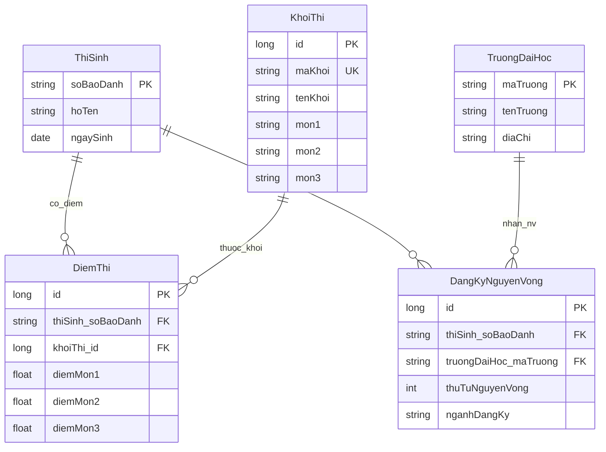

## 2. Giới thiệu đề tài (Introduction)

### 2.1 Mô tả ngắn về hệ thống (system)

**Hệ thống quản lý thí sinh dự thi đại học** là phần mềm **desktop** (Java Swing), kết nối **cơ sở dữ liệu MySQL** qua **Hibernate/JPA**. Hệ thống hỗ trợ:

- Quản lý **hồ sơ thí sinh** (số báo danh, họ tên, ngày sinh, địa chỉ, ưu tiên…).
- Quản lý **điểm thi theo khối** (ba môn, tổng điểm tính theo quy tắc ứng dụng).
- Quản lý **danh mục khối thi** và **trường đại học**.
- Quản lý **nguyện vọng xét tuyển** (thứ tự nguyện vọng, ngành đăng ký tùy chọn).

Giao diện có **đăng nhập**, **menu chức năng**, các màn hình tra cứu — chỉnh sửa trên **bảng (grid)** và một số **báo cáo thống kê** (sắp xếp điểm, thủ khoa theo khối, số lượng thí sinh theo khối, tổng nguyện vọng, thống kê ngành theo trường).

### 2.2 Mục tiêu (goal)

- **Số hóa** dữ liệu thí sinh — điểm — nguyện vọng, giảm sai sót so với ghi tay hoặc file rời.
- **Tập trung** dữ liệu vào một CSDL thống nhất, hỗ trợ tra cứu và cập nhật nhanh.
- **Phục vụ học tập / demo** mô hình ba lớp: giao diện — nghiệp vụ — truy cập dữ liệu.

### 2.3 Phạm vi (scope)

**Trong phạm vi đề tài:**

- Một máy chủ MySQL, một ứng dụng desktop kết nối trực tiếp.
- Chức năng CRUD cốt lõi cho thí sinh, điểm, trường, nguyện vọng; đăng nhập đơn giản (demo).
- Báo cáo thống kê theo khối / trường / ngành như đã cài đặt trong ứng dụng.

**Ngoài phạm vi (có thể mở rộng sau):**

- Triển khai web, đa người dùng đồng thời, phân quyền chi tiết.
- Tích hợp cổng điện tử Bộ GD&ĐT, xác thực thực tế.
- Giao dịch thanh toán lệ phí, xử lý file ảnh minh chứng.

---

## 3. Khảo sát hiện trạng (Current Situation Survey)

### 3.1 Mô tả thực tế

**Trước khi có hệ thống tập trung**, đơn vị tổ chức thi hoặc phòng khảo thí thường:

- Ghi nhận thí sinh và điểm trên **giấy tờ**, **bảng Excel** tách file theo khối hoặc theo đợt.
- Danh sách **trường ĐH** và **nguyện vọng** có thể lưu ở bảng biểu riêng, khó đối chiếu với điểm.

**Quy trình nghiệp vụ được hệ thống hỗ trợ (mức logic):**

1. **Nhập / cập nhật hồ sơ thí sinh** (định danh bằng **số báo danh**).
2. **Gán điểm thi** theo **khối** (mỗi cặp thí sinh — khối một bản ghi điểm).
3. **Đăng ký nguyện vọng**: mỗi thí sinh có nhiều NV, xếp **thứ tự**, chọn **trường**, ghi **ngành** (có thể để trống).
4. **Tra cứu — thống kê** (điểm, thủ khoa khối, số thí sinh theo khối, NV theo trường/ngành).

### 3.2 Vấn đề tồn tại


| Vấn đề                            | Diễn giải                                                                                                                                                         |
| --------------------------------- | ----------------------------------------------------------------------------------------------------------------------------------------------------------------- |
| **Dữ liệu trùng lặp (duplicate)** | Cùng thí sinh có thể được nhập nhiều lần trên nhiều sheet hoặc nhiều phiên bản file; khó đảm bảo một **định danh duy nhất** (số báo danh) cho mọi bảng liên quan. |
| **Khó quản lý (hard to manage)**  | Điểm và nguyện vọng tách rời dễ **lệch khối / lệch thứ tự NV**; cập nhật điểm sau chấm phải sửa nhiều chỗ; khó sinh báo cáo thống nhất.                           |


Hệ thống CSDL quan hệ với **khóa chính — khóa ngoại — ràng buộc duy nhất** giảm trùng lặp và hỗ trợ quản lý tập trung.

---

## 4. Xác định thực thể (Entity Identification)

### 4.1 Danh sách thực thể


| Tên thực thể (bảng)  | Ý nghĩa                                                                                                           |
| -------------------- | ----------------------------------------------------------------------------------------------------------------- |
| **ThiSinh**          | Lưu thông tin **thí sinh** dự thi; định danh chính là **số báo danh**.                                            |
| **KhoiThi**          | Danh mục **khối thi** (A, B, C…), cấu hình **ba môn** tương ứng.                                                  |
| **TruongDaiHoc**     | Danh mục **trường đại học** (mã trường, tên, địa chỉ).                                                            |
| **DiemThi**          | **Điểm thi** của một thí sinh theo **một khối** (ba môn; có thể để trống điểm khi “xóa điểm” nhưng vẫn giữ dòng). |
| **DangKyNguyenVong** | **Nguyện vọng** của thí sinh vào một trường, có **thứ tự ưu tiên** và **ngành đăng ký** (tùy chọn).               |


### 4.2 Thuộc tính của thực thể

#### ThiSinh


| Thuộc tính                | Loại              | Mô tả                                             |
| ------------------------- | ----------------- | ------------------------------------------------- |
| soBaoDanh                 | **Primary Key**   | Số báo danh (chuỗi, duy nhất định danh thí sinh). |
| hoTen                     | Normal (bắt buộc) | Họ và tên.                                        |
| ngaySinh                  | Normal (bắt buộc) | Ngày sinh.                                        |
| danToc, tonGiao, gioiTinh | Normal            | Thông tin nhân khẩu học / giới tính.              |
| noiSinh, diaChi           | Normal            | Nơi sinh, địa chỉ liên hệ.                        |
| soCanCuoc                 | Normal (unique)   | Số căn cước (duy nhất nếu có).                    |
| soDienThoai, email        | Normal            | Liên lạc.                                         |
| khuVuc                    | Normal            | Khu vực ưu tiên (nếu dùng).                       |
| doiTuongUuTien            | Normal            | Đối tượng ưu tiên (mã số).                        |
| hoiDongThi                | Normal            | Hội đồng thi (nếu ghi nhận).                      |


#### KhoiThi


| Thuộc tính       | Loại                        | Mô tả                    |
| ---------------- | --------------------------- | ------------------------ |
| id               | **Primary Key** (surrogate) | Khóa số tự tăng.         |
| maKhoi           | Normal (unique, bắt buộc)   | Mã khối (ví dụ A, B, C). |
| tenKhoi          | Normal                      | Tên hiển thị khối.       |
| mon1, mon2, mon3 | Normal                      | Tên ba môn thi của khối. |


#### TruongDaiHoc


| Thuộc tính | Loại              | Mô tả              |
| ---------- | ----------------- | ------------------ |
| maTruong   | **Primary Key**   | Mã trường (chuỗi). |
| tenTruong  | Normal (bắt buộc) | Tên trường.        |
| diaChi     | Normal            | Địa chỉ.           |


#### DiemThi


| Thuộc tính                   | Loại                        | Mô tả                                               |
| ---------------------------- | --------------------------- | --------------------------------------------------- |
| id                           | **Primary Key** (surrogate) | Khóa số tự tăng.                                    |
| thiSinh (FK)                 | **Foreign Key** → ThiSinh   | Thí sinh.                                           |
| khoiThi (FK)                 | **Foreign Key** → KhoiThi   | Khối thi.                                           |
| diemMon1, diemMon2, diemMon3 | Normal (nullable)           | Điểm từng môn; NULL khi chưa nhập hoặc đã xóa điểm. |


*Ràng buộc:* một cặp **(thí sinh, khối)** chỉ một bản ghi (unique trong thiết kế ứng dụng).

#### DangKyNguyenVong


| Thuộc tính        | Loại                           | Mô tả                           |
| ----------------- | ------------------------------ | ------------------------------- |
| id                | **Primary Key** (surrogate)    | Khóa số tự tăng.                |
| thiSinh (FK)      | **Foreign Key** → ThiSinh      | Thí sinh đăng ký.               |
| truongDaiHoc (FK) | **Foreign Key** → TruongDaiHoc | Trường được chọn.               |
| thuTuNguyenVong   | Normal (bắt buộc)              | Thứ tự NV (1, 2, …).            |
| nganhDangKy       | Normal (nullable)              | Ngành đăng ký; có thể để trống. |


*Ràng buộc:* không trùng **thứ tự nguyện vọng** cho cùng một thí sinh (unique theo thiết kế).

---

## 5. Xác định mối liên kết (Relationship)


| Thực thể 1       | Thực thể 2           | Quan hệ   | Giải thích                                                                                                       |
| ---------------- | -------------------- | --------- | ---------------------------------------------------------------------------------------------------------------- |
| **ThiSinh**      | **DiemThi**          | **1 — N** | Một thí sinh có thể có **nhiều bản ghi điểm**, mỗi bản ghi tương ứng **một khối** (thực tế thường một vài khối). |
| **KhoiThi**      | **DiemThi**          | **1 — N** | Một khối có **nhiều** bản ghi điểm của nhiều thí sinh.                                                           |
| **ThiSinh**      | **DangKyNguyenVong** | **1 — N** | Một thí sinh đăng ký **nhiều nguyện vọng** (thứ tự khác nhau).                                                   |
| **TruongDaiHoc** | **DangKyNguyenVong** | **1 — N** | Một trường nhận **nhiều** nguyện vọng từ nhiều thí sinh.                                                         |


**Ghi chú:** Quan hệ **ThiSinh — TruongDaiHoc** là **N — N** về mặt nghiệp vụ (một thí sinh nhiều trường, một trường nhiều thí sinh), được **giải quyết** bằng bảng trung gian **DangKyNguyenVong** (có thêm thứ tự NV và ngành).

---

## 6. ERD (Entity Relationship Diagram)

### 6.1 Sơ đồ (Mermaid)




### 6.2 Mô tả sơ đồ

- **ThiSinh** là trung tâm: liên kết xuống **DiemThi** và **DangKyNguyenVong**.
- **DiemThi** nối **ThiSinh** và **KhoiThi**, thể hiện điểm theo từng khối.
- **DangKyNguyenVong** nối **ThiSinh** và **TruongDaiHoc**, bổ sung thuộc tính **thứ tự** và **ngành**.

Có thể vẽ lại bằng **draw.io** (import ERD) hoặc xuất ảnh từ công cụ hỗ trợ Mermaid để chèn vào báo cáo Word.

---

## 7. Chuẩn hóa dữ liệu (Normalization)

### 7.1 Dạng chuẩn 1 (1NF)

- Mỗi ô chứa **một giá trị nguyên tử** (không lưu “ba môn” trong một cột kiểu danh sách không tách được).
- Ba môn trong **KhoiThi** là **ba cột riêng** (`mon1`, `mon2`, `mon3`); điểm tương ứng là **ba cột** trong **DiemThi**.
- **Không có nhóm lặp** không tách bạch: thông tin thí sinh nằm trong **ThiSinh**, không nhân bản bất hợp lý trong từng dòng điểm (chỉ lưu khóa ngoại).

→ Thiết kế **đạt 1NF**.

### 7.2 Dạng chuẩn 2 (2NF)

Áp dụng cho bảng có **khóa tổ hợp**. Ở đây các bảng chính dùng **khóa surrogate** (`id`) hoặc **khóa đơn** (`soBaoDanh`, `maTruong`) và các thuộc tính không khóa **phụ thuộc toàn phần** vào khóa chính của bảng đó.

- **DiemThi:** `diemMon1..3` phụ thuộc vào toàn bộ khóa của bảng `DiemThi` (id), không phụ thuộc một phần khóa tổ hợp không tồn tại theo nghĩa 2NF cổ điển vì khóa là `id` đơn.
- **DangKyNguyenVong:** `nganhDangKy`, `truongDaiHoc` phụ thuộc `id` bản ghi NV.

→ **Đạt 2NF** trong mô hình quan hệ đã tách bảng.

### 7.3 Dạng chuẩn 3 (3NF)

- Không để thuộc tính không khóa phụ thuộc **bắc cầu** vào khóa (ví dụ: không lưu **tên khối** trong `DiemThi` vì đã có `khoiThi_id` → tra **KhoiThi**).
- Không lưu **tên trường** trùng lặp trong `DangKyNguyenVong` nếu đã có `maTruong` → **TruongDaiHoc**.

→ Các quan hệ **đạt 3NF** khi tuân thủ thiết kế chỉ lưu khóa ngoại và thuộc tính thuộc về bản ghi đó.

**Kết luận:** Lược đồ **đạt chuẩn 3NF** với giả định không thêm các cột dư thừa phụ thuộc bắc cầu.

---

## 8. Chuyển sang bảng MySQL (Database Design)

### 8.1 Danh sách bảng


| Tên bảng             | Mô tả                                |
| -------------------- | ------------------------------------ |
| **ThiSinh**          | Thông tin thí sinh.                  |
| **KhoiThi**          | Danh mục khối và ba môn.             |
| **TruongDaiHoc**     | Danh mục trường đại học.             |
| **DiemThi**          | Điểm theo thí sinh và khối.          |
| **DangKyNguyenVong** | Nguyện vọng theo thí sinh và trường. |


### 8.2 Cấu trúc bảng (minh họa SQL)

> Kiểu dữ liệu có thể tinh chỉnh theo script thực tế trong dự án (`mysql_university_entrance_exam.sql.txt` hoặc script sinh dữ liệu). Dưới đây là bản **tương đương** logic với entity JPA.

```sql
-- Danh mục khối thi
CREATE TABLE KhoiThi (
    id BIGINT AUTO_INCREMENT PRIMARY KEY,
    maKhoi VARCHAR(10) NOT NULL UNIQUE,
    tenKhoi VARCHAR(50) NOT NULL,
    mon1 VARCHAR(50) NOT NULL,
    mon2 VARCHAR(50) NOT NULL,
    mon3 VARCHAR(50) NOT NULL
);

-- Thí sinh
CREATE TABLE ThiSinh (
    soBaoDanh VARCHAR(20) PRIMARY KEY,
    hoTen VARCHAR(120) NOT NULL,
    ngaySinh DATE NOT NULL,
    danToc VARCHAR(50),
    tonGiao VARCHAR(50),
    gioiTinh VARCHAR(10),
    noiSinh VARCHAR(120),
    diaChi VARCHAR(255),
    soCanCuoc VARCHAR(20) UNIQUE,
    soDienThoai VARCHAR(20),
    email VARCHAR(100),
    khuVuc VARCHAR(20),
    doiTuongUuTien INT NOT NULL DEFAULT 0,
    hoiDongThi VARCHAR(50)
);

-- Trường đại học
CREATE TABLE TruongDaiHoc (
    maTruong VARCHAR(20) PRIMARY KEY,
    tenTruong VARCHAR(150) NOT NULL,
    diaChi VARCHAR(255)
);

-- Điểm thi (một thí sinh — một khối: duy nhất)
CREATE TABLE DiemThi (
    id BIGINT AUTO_INCREMENT PRIMARY KEY,
    thiSinh_soBaoDanh VARCHAR(20) NOT NULL,
    khoiThi_id BIGINT NOT NULL,
    diemMon1 DECIMAL(4,2) NULL,
    diemMon2 DECIMAL(4,2) NULL,
    diemMon3 DECIMAL(4,2) NULL,
    CONSTRAINT fk_diem_thisinh FOREIGN KEY (thiSinh_soBaoDanh) REFERENCES ThiSinh(soBaoDanh),
    CONSTRAINT fk_diem_khoi FOREIGN KEY (khoiThi_id) REFERENCES KhoiThi(id),
    UNIQUE KEY uk_diem_thisinh_khoithi (thiSinh_soBaoDanh, khoiThi_id)
);

-- Nguyện vọng (một thí sinh không trùng thứ tự NV)
CREATE TABLE DangKyNguyenVong (
    id BIGINT AUTO_INCREMENT PRIMARY KEY,
    thiSinh_soBaoDanh VARCHAR(20) NOT NULL,
    truongDaiHoc_maTruong VARCHAR(20) NOT NULL,
    thuTuNguyenVong INT NOT NULL,
    nganhDangKy VARCHAR(120) NULL,
    CONSTRAINT fk_nv_thisinh FOREIGN KEY (thiSinh_soBaoDanh) REFERENCES ThiSinh(soBaoDanh),
    CONSTRAINT fk_nv_truong FOREIGN KEY (truongDaiHoc_maTruong) REFERENCES TruongDaiHoc(maTruong),
    UNIQUE KEY uk_nv_thisinh_thutu (thiSinh_soBaoDanh, thuTuNguyenVong)
);
```

---

## 9. Kết luận (Conclusion)

### 9.1 Tổng kết kết quả

- Đề tài xây dựng **mô hình dữ liệu quan hệ** gồm năm bảng chính, phản ánh đúng nghiệp vụ **thí sinh — điểm theo khối — nguyện vọng theo trường**.
- Ứng dụng Java Swing triển khai **CRUD** và **thống kê** trên nền **MySQL**, phù hợp báo cáo môn Lập trình Windows / Cơ sở dữ liệu.
- Thiết kế **3NF** giảm dư thừa, hỗ trợ toàn vẹn dữ liệu nhờ **khóa ngoại** và **ràng buộc duy nhất**.

### 9.2 Hướng phát triển (future)

- **Bảo mật:** mã hóa mật khẩu, phân quyền vai trò (admin / nhập liệu / xem).
- **Triển khai:** ứng dụng web hoặc API REST để truy cập từ nhiều máy.
- **Nghiệp vụ:** import/export Excel, in phiếu điểm, lịch sử thay đổi (audit log).
- **Kiểm thử:** unit test cho service, kiểm thử giao diện tự động (tùy môn học).

---

*Tài liệu phục vụ báo cáo môn học; có thể chỉnh sửa định dạng khi chép sang Word (heading, số mục, chèn hình ERD từ draw.io).*